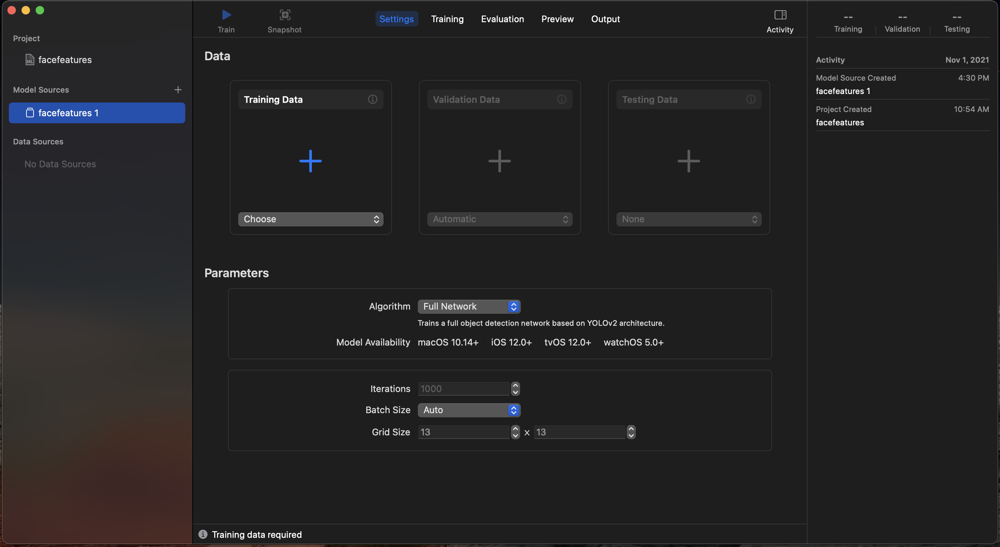

# Create ML Benchmark

I made this CreateML project to benchmark Apple's M1 Macbook Air and 2021 M1 Max Macbook Pro. The project uses the object detection model with a simple dataset I created on roboflow. This isn't meant to produce a useful model. The main purpose is to measure the performance of macbooks with different dataset and batch sizes. I have several NVidia video cards for doing ML training, but these days the cards are over priced due to supply shortage.

The cost of a high end RTX 3090 24G is around $3000.00 on newegg (Nov/2021). This makes the M1 Max macbook an interesting alternative for light weight experiments. I hope other people find these results useful and interesting.

[https://github.com/woolfel/createmlbench/tree/main/results/coco] - Results for COCO dataset on M1 Max MBP

## Jan 2023 Update

Due to the GPU market crash, the price for RTX 3090 24G is down to $1,000-2,200 on amazon. That's still too expensive for me. The speced out M2Max MBP cost $4,500 and is still a better bargain than spending $2,000 for RTX 3090. To get a NVidia video card with 40G, you'd have to spend $9,800 for a Tesla A100. That is an impressive card, but it chew Watts like it's a hungry hippo.

## Performance Notes

Back in November of 2021, there was a bug with CreateML. If you created an object detection project and set it to transfer learning, it wouldn't fully utilize the GPU. This was repeatable on both M1 MBAir and M1Max BMP. If you set it to full network, GPU usage during training would be over 80%.

The latest version of CreateML seems to have fix the odd GPU utilization bug from 2021. If you set it to use transfer learning, it uses 95% of the GPU. If you set it to fully network, the GPU usage is around 75%. On M1Max, activity monitor reports 75-80% cpu usage across all cores. On M2Max, activity monitor reports 200-250% cpu usage across all cores. The changes to both GPU and CPU have made significant improvement to utilitization for training.

I'm glad I bought a M2Max with 38GPU and 96G.

## Roboflow Project

The dataset is up on Roboflow.com. You can download the datasets with these links

[https://universe.roboflow.com/peter-lin/face-features-test] - a selection of images from coco dataset with eyes and nose bounding boxes.

This is a toy dataset for benchmarking hardware!

## Roboflow public datasets

To get a better idea of the performance limits of the new M1 Max SOC, I decided to use the public datasets and ran a bunch of tests. You can find the public datasets for Microsoft COCO and Pascal VOC at the url below. When you download the public datasets, make sure to select createml format. If you already have COCO and VOC dataset, you may still want to use roboflow version to avoid converting the annotations manually.

[https://public.roboflow.com/object-detection/microsoft-coco-subset] - microsoft coco 2017

[https://public.roboflow.com/object-detection/pascal-voc-2012] - Pascal VOC dataset 2012

## Running the benchmark

1. clone the repository "git clone https://github.com/woolfel/createmlbench"
2. download the dataset and extract it to the desired location
3. open the CreateML project 
4. The data sources need to be set before you can start training. Click Choose and open the train folder
5. Set validation data to the valid folder
6. Set testing data to the test folder
7. Use 1000 for the iterations
8. Change the batch size
9. Click Train button to start training

CreateML doesn't give you a summary of how long the train+test takes. What I do is create a spreadsheet or text file to record the start time and end time.

## Running different Batch size

The easiest way to run the same project with different batch size is to add model sources

1. Click the + icon next to model sources
2. select the data source for training, validation, test
3. select full network or transfer learning
4. enter iterations
5. select the batch size
6. click train button

## Reseting the Project for different batch size

With version 3.0, CreateML doesn't let you change the batch size of a model source after it has run training. To get around that, I manually reset the project. Here are the steps for resetting the project from terminal. Only use this method if you don't want to use add model sources.

1. Open terminal window
2. Go to the folder where you cloned the repo
3. Change to projects folder. You should see the list of projects
4. use "cd" to change to project folder. Example: "cd CocoObjDetect.mlproj"
5. Run "ls -al" to see the files in the folder
6. Delete the data in checkpoints folder with "rm -Rf CheckPoints"
7. Delete the Data sources settings with "rm -Rf Data\ Sources"
8. Delete the model snapshots with "rm -Rf Snapshots"
9. Delete the setting configuration with "rm -f Model\ Containers/*"
10. Reopen the project

The createml project should be ready for training with different settings.

## Useful Links about hardware acceleration
[https://timdettmers.com/2020/09/07/which-gpu-for-deep-learning/] - a great write up on NVidia RTX video cards for ML training
